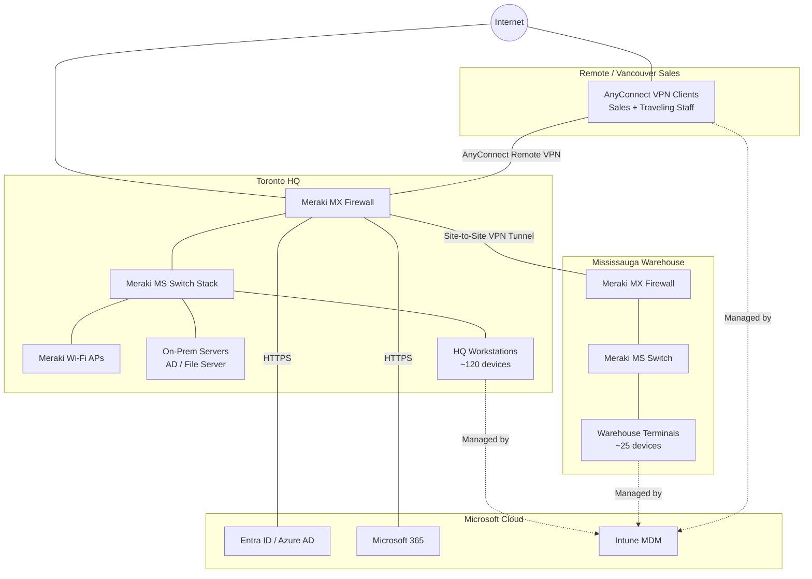

# Network Diagram

> This diagram uses [Mermaid](https://mermaid.js.org/) syntax, which renders automatically in GitHub's markdown viewer — no image file needed.

## Overview

Lumen Systems operates a hub-and-spoke network: Toronto HQ as the core, with site-to-site VPN tunnels to the Mississauga Warehouse and a remote-access VPN for the Vancouver Sales Office and traveling employees.

## Key Paths (for troubleshooting reference)

| Scenario | Path |
|---|---|
| HQ user can't reach file server | Endpoint → HQ Switch → HQ Firewall (internal routing) |
| Warehouse can't reach HQ file server | Warehouse Switch → Warehouse Firewall → Site-to-Site VPN Tunnel → HQ Firewall → HQ Switch → Server |
| Remote sales rep can't connect | Client → Internet → AnyConnect Remote VPN → HQ Firewall |
| VPN connects but no internal access | Check split-tunnel/access group assignment — see `sop/SOP-002-vpn-account-provisioning.md` |

## IP Addressing (reference)

| Site | Subnet | VLANs |
|---|---|---|
| Toronto HQ | 10.10.0.0/22 | 10 (Corp), 20 (Wi-Fi), 30 (Servers) |
| Mississauga Warehouse | 10.20.0.0/24 | 10 (Corp) |
| VPN Client Pool | 10.99.0.0/24 | — |
